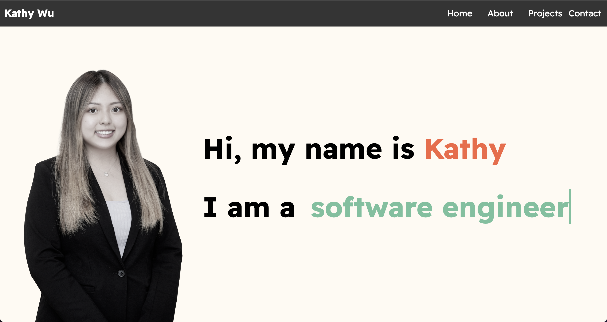
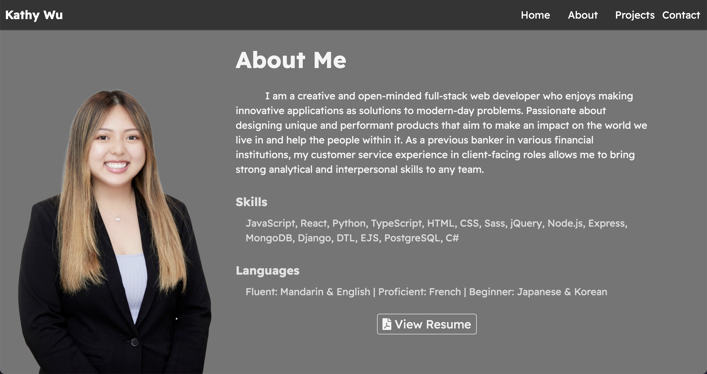
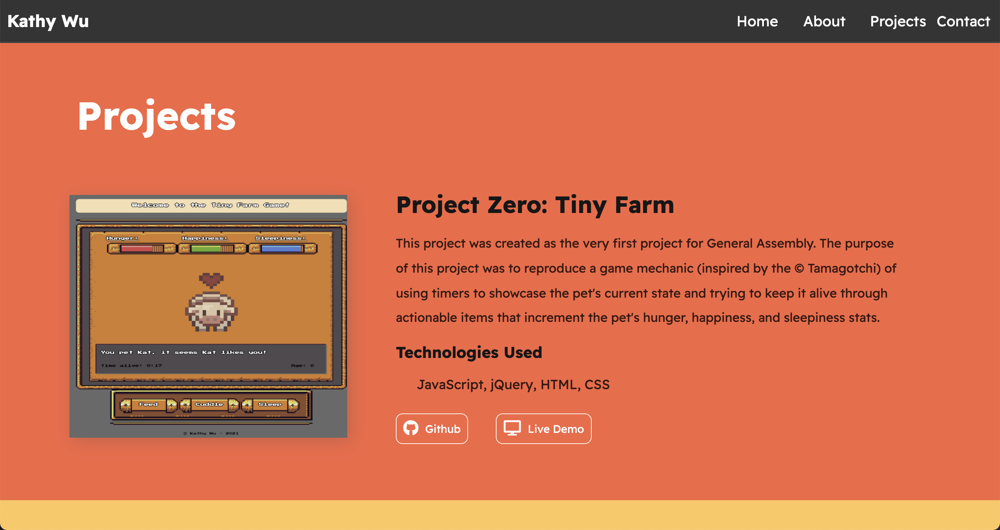
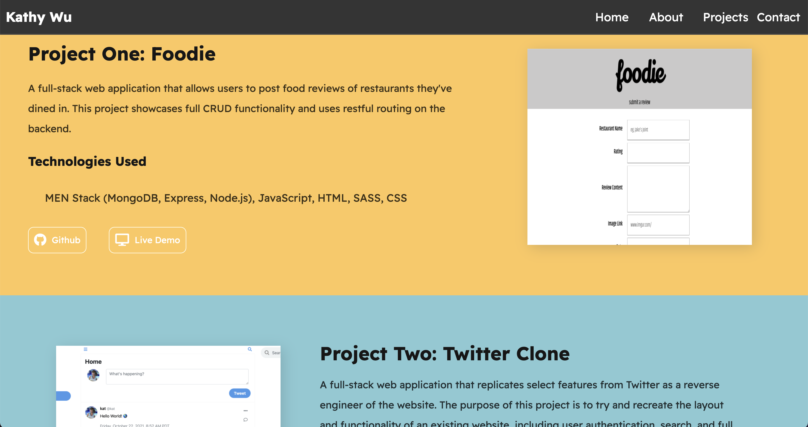
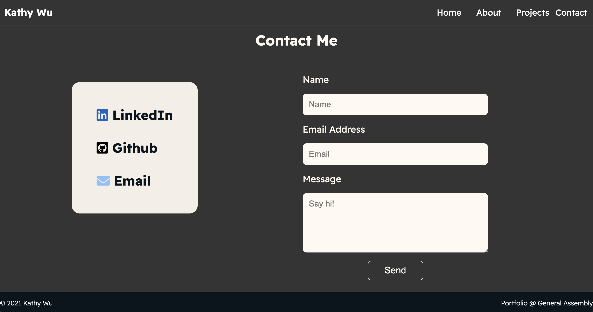
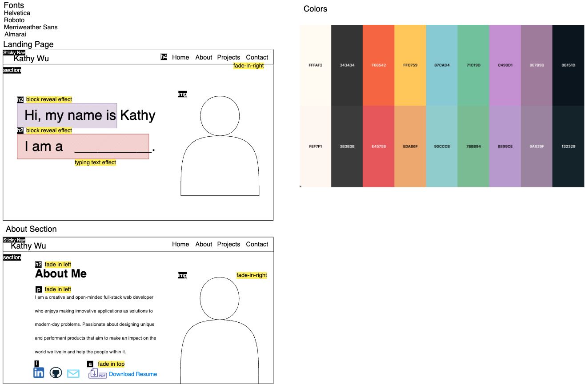
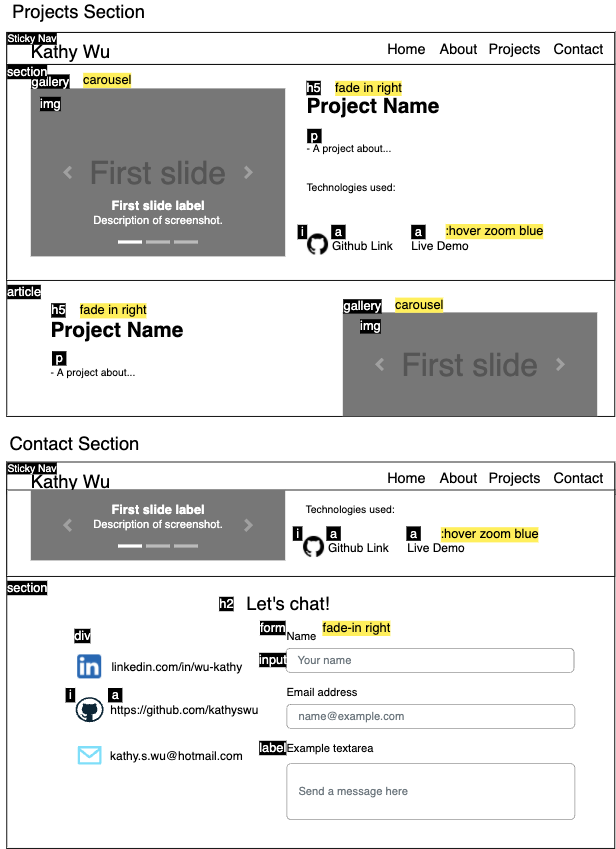

# Kathy's Portfolio Website

### Made by: Kathy Wu 

> A portfolio website describing a bit about me, showcasing my projects during General Assembly Software Engineering Immersive's Coding Bootcamp, and my contact information.
> The project uses good ol' regular HTML, CSS, and JavaScript.

# Live Link

## Table of Contents

- [Technologies Used](#technologies-used)
- [Screenshots](#screenshots)
- [Wireframes](#wireframse)
- [Project Status](#project-status)
- [Future Improvements](#future-improvements)
- [Acknowledgements](#acknowledgements)

## Technologies Used

- HTML
- CSS
- JavaScript

## Screenshots

## Wireframes

## Project Status

Complete

## Future Improvements

Plans for future improvement:

- Add more CSS fun animations
- Introduce mobile-responsiveness

## Acknowledgements

- All the staff at General Assembly
- My cohort :)
